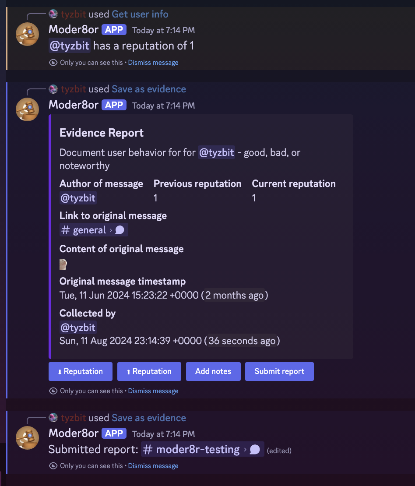
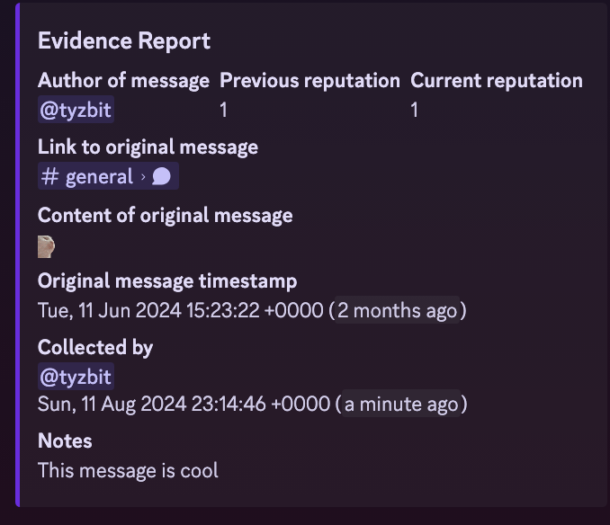

# go-discord-modtools

Discord moderation bot written in Go

## Configuration

Set some environment variables before launching, or add a `.env` file.

If database environment variables are provided, the bot will save stats to an external database.
Otherwise, it will save stats to a local sqlite database at `/var/go-discord-modtools/local.db`

| Variable    | Value(s)                                  |
| :---------- | :---------------------------------------- |
| DB_TYPE     | `mysql`, `postgres` or unset for sqlite   |
| DB_NAME     | Database name for database                |
| DB_HOST     | Hostname for database                     |
| DB_PASSWORD | Password for database user                |
| DB_USER     | Username for database user                |
| LOG_LEVEL   | `trace`, `debug`, `info`, `warn`, `error` |
| TOKEN       | The Discord token the bot should use      |

PostgreSQL requires SSL to be enabled for your database.

## Usage

In the Discord app, right click (Desktop) or long press (mobile)
a message or user to see the available options.

### Commands

Configure the bot (Highly recommended to do so only people in a specific role can use the moderation commands):

`/settings`

Get reputation for a user:

`/query`

Add a custom command (simply posts your desired block of text, Markdown formatting enabled)

`/addcommand`

Remove a custom command

`/deletecommand`

Get this help message:

`/help`

## Development

Create a `.env` file with your configuration, at the bare minimum you need
a Discord token for `TOKEN`.

You can either `docker compose up --build` to run with a mysql database, or just `go run main.go` to run with a sqlite database.

## Self-hosting

- Create a bot here: https://discord.com/developers/applications

- Go to "Bot" -> Copy token, it should be set as the `TOKEN` environment variable

- Go to Oauth2 -> save your Client ID to your notes

- Add it to your server by visiting https://discord.com/oauth2/authorize?client_id=CLIENT_ID&permissions=277025507392&scope=bot,
  replacing CLIENT_ID with your client ID.
